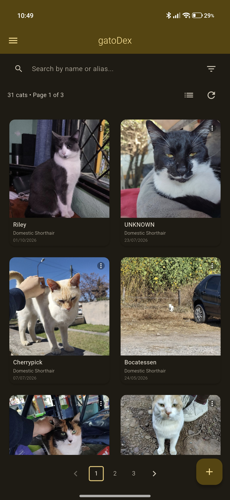
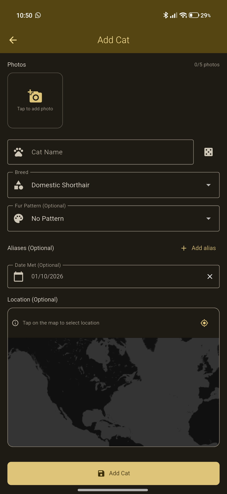
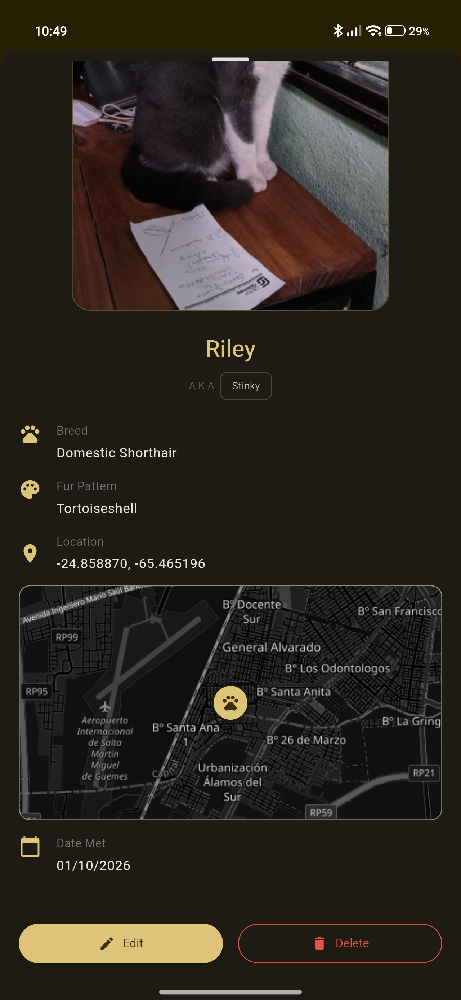
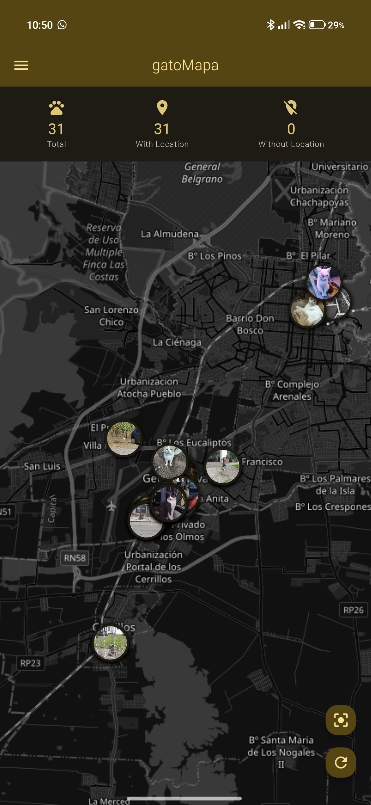
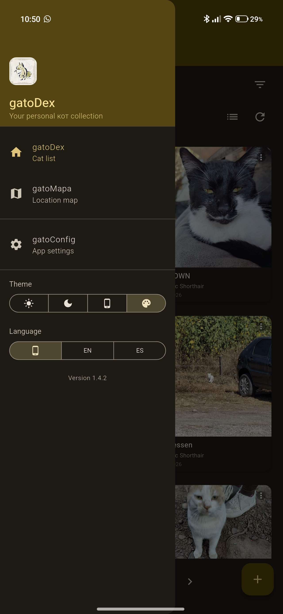
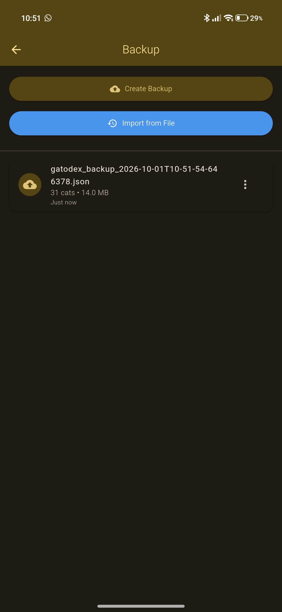

<div align="center">


# GatoDex

### Your personal cat collection

<br/>

[](https://github.com/devinaxo/GatoDex-Flutter/releases)
[](https://github.com/devinaxo/GatoDex-Flutter/releases)
[](https://github.com/devinaxo/GatoDex-Flutter/stargazers)
[](https://flutter.dev)

<br/>

[](https://twitter.com/devinachoes)

<br/>

[**Download**](#download) · [**Features**](#features) · [**Screenshots**](#screenshots) · [**Credits**](#credits)

</div>

> [!NOTE]
> **100% local & offline-first.** GatoDex stores everything in an on-device SQLite database. There is no account, no tracking, no analytics and no server — your cats never leave your phone.
> The only features that need a connection are the **OpenStreetMap tiles** (the map screen degrades to a blank canvas offline) and the **random cat name generator**. Everything else works fully offline.

---

<div align="center">

<h1><a id="screenshots"></a>Screenshots</h1>








</div>

---

<div align="center">

<h1><a id="features"></a>Features</h1>

<table>
  <tr>
    <td width="50%" valign="top">

#### Your collection

- Up to **5 photos** per cat, straight from the camera or your gallery
- Photo gallery with a fullscreen, zoomable viewer
- Unlimited **aliases**, for those specimens that can't be contained within a single moniker
- **10 breeds** and **12 fur patterns**, might be customizable in the future
- Date met for every cat
- Edit or delete any cat, with photo files cleaned up for you
- **Random cat name generator** (courtesy of [cat-name-api](https://tools.estevecastells.com/cat-name-api))

</td>
    <td width="50%" valign="top">

#### Finding cats

- Search by **name or alias**
- Filter by **breed**, **fur pattern** and **date range**
- **List and grid view**
- Paginated 12-per-page browsing
- Live counters: total cats, cats with a location, cats without

</td>
  </tr>
  <tr>
    <td width="50%" valign="top">

#### Maps & locations

- **gatoMapa** — every located cat as a photo pin on an OpenStreetMap map
- Tap a pin to fly to it and open its details
- **Tap anywhere on the map** to drop a cat's location
- **Use my current location** (stored only in your device)
- Map tiles supporting dark mode
- Mini map embedded in each cat's details sheet

</td>
    <td width="50%" valign="top">

#### Backup & data

- One-tap **JSON backup** with all photos embedded
- **Import** a backup: _add only new_ (merge) or _replace all_
- **Share** any backup straight to another app
- Open a `.json` backup from any Android app and GatoDex picks it up
- Backup history with cat count, file size and relative date
- Debug info: Built-in **database inspector**: path, size, version, and one-tap recreate

</td>
  </tr>
  <tr>
    <td colspan="2" valign="top">

#### Interface

- Built with **Material 3** and Flutter
- **Light / Dark / System / Material You** themes, switchable from the drawer
- **English and Spanish**, switchable at runtime
- Material You **home screen widgets** in 3×3, 2×2 _cat picture viewer_ and a 1×1 _cat quick add_ shortcut

</td>
  </tr>
</table>

</div>

---

<div align="center">

<h1><a id="download"></a>Download</h1>

<h3>All builds are published on the Releases page. Grab the latest APK:</h3>

<a href="https://github.com/devinaxo/GatoDex-Flutter/releases/latest">
  
</a>

<br/>

<table>
  <tr>
    <th align="center">Latest release</th>
    <th align="center">All releases</th>
  </tr>
  <tr>
    <td align="center">
      <a href="https://github.com/devinaxo/GatoDex-Flutter/releases/latest">
        
      </a>
    </td>
    <td align="center">
      <a href="https://github.com/devinaxo/GatoDex-Flutter/releases">
        
      </a>
    </td>
  </tr>
</table>

<br/>

<h3>Installing</h3>

<table>
  <tr>
    <th align="center">1. Download</th>
    <th align="center">2. Install</th>
    <th align="center">3. Open</th>
  </tr>
  <tr>
    <td align="left">Download the latest <code>gatoDex-x.y.z.apk</code> from the Releases page.</td>
    <td align="left">Tap the file and confirm the install. Android asks for permission to install unknown apps — allow it for your browser or file manager.</td>
    <td align="left">Launch <strong>gatoDex</strong> and tap <strong>+</strong> to register your first cat.</td>
  </tr>
</table>

<h3>Building from source</h3>

```bash
git clone https://github.com/devinaxo/GatoDex-Flutter.git
cd GatoDex-Flutter
flutter pub get
flutter run
```

Release APKs are built with the included script:

```powershell
./build_release.ps1   # builds build/app/outputs/flutter-apk/gatoDex-<version>.apk
```

</div>

---

<div align="center">

<h1><a id="credits"></a>Credits</h1>

<h3>Built with love using Flutter</h3>

<table>
  <thead>
    <tr>
      <th align="center">Project</th>
      <th align="center">Contribution</th>
    </tr>
  </thead>
  <tbody>
    <tr>
      <td align="center"><a href="https://www.openstreetmap.org/copyright"><strong>OpenStreetMap</strong></a></td>
      <td>Map data and tile imagery for gatoMapa</td>
    </tr>
    <tr>
      <td align="center"><a href="https://github.com/FlutterFlutter/Flutter"><strong>Flutter</strong></a> · <a href="https://github.com/fleaflet/flutter_map"><strong>flutter_map</strong></a> · <a href="https://github.com/tekartik/sqflite"><strong>sqflite</strong></a></td>
      <td>The framework and packages GatoDex is built on</td>
    </tr>
    <tr>
      <td align="center"><a href="https://www.flaticon.com/free-icons/pokemon"><strong>Flaticon</strong></a></td>
      <td>Cat and paw icons artwork</td>
    </tr>
    <tr>
      <td align="center"><a href="https://tools.estevecastells.com/cat-name-api"><strong>Cat Name API</strong></a></td>
      <td>Random cat name generator</td>
    </tr>
  </tbody>
</table>

</div>

---

<div align="center">

<br/>

**Made with ❤️ by [devinaxo](https://github.com/devinaxo)**

</div>
